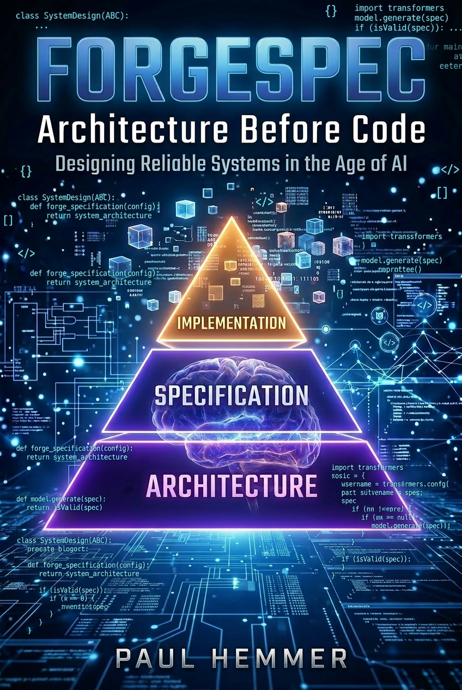

# ForgeSpec



**ForgeSpec** is a spec‑driven architecture framework for building reliable software systems with AI coding agents.

Instead of asking an AI to immediately write code, ForgeSpec introduces a disciplined engineering workflow:

```
problem → architecture → spec → implementation
```

The architecture spec becomes the **single source of truth** guiding implementation.

---

# The Book

The full ForgeSpec methodology is described in the book:

# ForgeSpec  
### Architecture Before Code  
### Designing Reliable Systems in the Age of AI

by Paul Hemmer

📘 Available on Amazon

The book explains:

• the architecture‑first approach to AI development  
• spec design principles  
• concurrency modeling and system invariants  
• verification of pipeline architectures  
• how to safely guide AI coding agents during large implementations  

This repository contains the **working prompts, templates, and example workflows** referenced in the book.

---

# Start Here

If you are new to ForgeSpec:

1. Read **`ForgeSpec_WORKFLOW.md`** for the canonical step‑by‑step workflow
2. Follow **`QUICKSTART.md`** for a minimal example
3. Study **`examples/EXAMPLE_PROJECT.md`** for a full worked example
4. Use the prompts in the **`prompts/`** directory to generate and validate specs
5. For optional bounded implementation discipline, see **`docs/IMPLEMENTATION_EXECUTION.md`**

---

# Why ForgeSpec Exists

AI coding agents are powerful, but without architectural guidance they tend to:

- drift from intended designs
- introduce hidden concurrency bugs
- accumulate accidental complexity
- violate resource constraints
- lose global system structure over long sessions

ForgeSpec prevents these problems by generating a **formal architecture spec first**.

The spec defines:

- system structure
- execution model
- work units
- concurrency boundaries
- shutdown behavior
- system invariants

Once the architecture is captured in a spec repository, AI coding agents can implement the system **safely and consistently**.

Many teams still ship successfully with integration tests, careful reading, and engineer intuition; ForgeSpec does not replace that wholesale. The extra rigor matters when implementation is **delegated** or **high-volume**: obligations that used to stay tacit in a few experienced heads must become **explicit** in the repository—contracts, acceptance criteria, **traceability** (stable ARCH/SPEC/TASK/TEST IDs), and **machine-checkable** tests—especially at subsystem boundaries, lifecycle and state transitions, ordering and failure semantics, and other places drift is easy to miss. The aim is **minimal sufficient** proof of what must not change silently, not micro-testing every internal helper. The book explains this in **Chapter 12 — Implementing Within a Spec** (in particular *If the test plan looks like overkill* and *On Granularity and Diminishing Returns*). Operational guardrails match that stance in **`prompts/PROMPT1_GENERATE_SPEC.md`** under **TRACEABILITY** and the **Proportionality** rule (every invariant needs a proof path, but not a maximized test count).

---

# Core Capabilities

ForgeSpec provides four core capabilities:

| Capability | Description |
|------------|-------------|
| **generate_spec** (`prompts/PROMPT1_GENERATE_SPEC.md`) | Generate a full architecture spec from a plain‑English problem description |
| **validate_spec** (`prompts/PROMPT2_VALIDATE_SPEC.md`) | Perform a deep architecture review and detect design flaws |
| **reverse_spec** (`prompts/PROMPT3_REVERSE_SPEC.md`) | Derive a spec from an existing codebase or architecture |
| **architecture_compare** (`prompts/PROMPT4_ARCHITECTURE_COMPARE.md`) | Evaluate competing system designs using structured review criteria |

These capabilities allow ForgeSpec to support **both new systems and legacy systems**.

---

# What ForgeSpec Produces

The toolkit generates a **spec repository** describing the architecture of a system.

Typical structure:

```
spec/
    spec.md
    engineering_rules.md
    pipeline_work_units.md
    pipeline_thread_model.md

docs/
    AI_CONTEXT.md
    SYSTEM_OVERVIEW.md
    ARCHITECTURE.md
    invariants.md
    IMPLEMENTATION_PLAN.md
    TRACEABILITY.md
    DECISIONS.md
    VALIDATION_CHECKLIST.md
    GLOSSARY.md

design_reviews/
    (optional additional review index files)
```

The `spec/` directory defines the **canonical architecture**.

The `docs/` directory contains explanatory and operational documentation.

---

# Typical Workflows

## Designing a New System

```
problem narrative
        ↓
PROMPT1_GENERATE_SPEC (generate_spec)
        ↓
spec repository
        ↓
PROMPT2_VALIDATE_SPEC (validate_spec)
        ↓
implementation
```

## Stabilizing a Legacy System

```
existing codebase
        ↓
PROMPT3_REVERSE_SPEC (reverse_spec)
        ↓
spec repository
        ↓
PROMPT2_VALIDATE_SPEC (validate_spec)
        ↓
architecture stabilization
```

## Comparing Two Designs

```
architecture A
architecture B
        ↓
PROMPT4_ARCHITECTURE_COMPARE (architecture_compare)
        ↓
architecture decision
```

---

# Reverse‑Engineering Existing Systems

ForgeSpec can also generate a spec from an **existing codebase or architecture**.

Run:

```
prompts/PROMPT3_REVERSE_SPEC.md
```

This prompt analyzes:

- source code
- repository structure
- architecture descriptions
- legacy documentation

and derives a **formal architecture spec repository**.

This allows teams to:

- document undocumented systems
- stabilize legacy architectures
- prepare systems for safe refactoring
- migrate legacy codebases to spec‑driven development

---

# Deterministic Pipeline Graph Verification (Advanced)

ForgeSpec can also support **formal verification of pipeline architectures**.

When a system is defined as a pipeline or message‑passing DAG, the spec can be analyzed to verify:

- queue dependency graphs
- bounded buffering
- backpressure propagation
- absence of deadlocks
- deterministic shutdown order
- correct stage ownership of work units

This allows engineers to **mathematically reason about the pipeline topology before writing code**.

Typical workflow:

```
pipeline spec
        ↓
validate_spec
        ↓
graph extraction
        ↓
queue dependency analysis
        ↓
design verification
```

This capability is especially valuable for:

- high‑throughput processing pipelines
- concurrent systems
- streaming architectures
- data ingestion platforms
- GPU processing pipelines

---

# Book vs Repository

The ForgeSpec **book** explains:

• the architectural discipline  
• spec design principles  
• concurrency modeling  
• pipeline verification  
• implementation discipline with AI coding agents  

The **repository** provides:

• the working prompts  
• architecture templates  
• example projects  
• workflow artifacts  

Think of the book as the **methodology**, and the repository as the **toolkit**.

---

# Key Principle

**If the implementation and the spec disagree, the spec wins.**

ForgeSpec treats the architecture spec as the **contract that governs the system**.

---

# ⭐ Support the Project

If you find ForgeSpec useful:

⭐ Star the repository  
📘 Read the book  
🔗 Share with other engineers using AI coding tools
