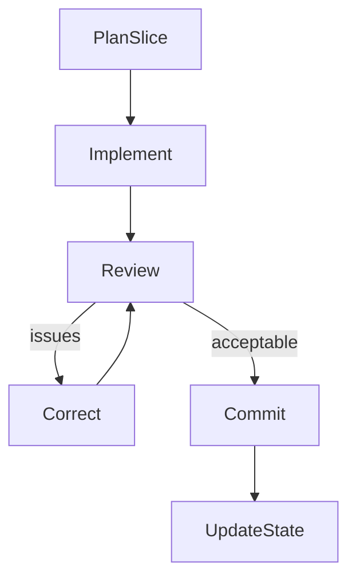

# Controlled Implementation Loop — execution model

This document describes the **Controlled Implementation Loop (CIL)**: optional, recommended operational discipline for implementation after architecture and specifications are stable. It applies whether implementation is **human-only**, **AI-assisted**, or mixed.

ForgeSpec does not require an LLM for implementation. CIL is a repeatable wrapper around bounded work, not a new mandatory methodology phase. For the overall workflow, see `[ForgeSpec_WORKFLOW.md](../ForgeSpec_WORKFLOW.md)` at the repository root.

---

## Definition

**Controlled Implementation Loop (CIL):** A structured, repeatable loop for executing implementation in bounded, traceable, reviewable steps derived from the specification and `docs/IMPLEMENTATION_PLAN.md`.

**Properties:**

- **Bounded scope** — one slice of the plan at a time; explicit in-scope and out-of-scope boundaries.
- **Explicit traceability** — each slice names relevant **ARCH-**, **SPEC-**, **SPEC-INV-**, **TASK-**, and **TEST-** IDs (see `docs/TRACEABILITY.md`).
- **Mandatory validation** — implementation is not “done” until reviewed against the spec and invariants for that slice.
- **No implicit architecture changes** — new subsystems, queues, retries, ownership shifts, or contract changes require updating spec and docs first, then implementation.

---

## Canonical loop

For **each** implementation slice (typically one **TASK-** or a small, explicitly listed set):

1. **PLAN SLICE** — Derive a bounded task from `docs/IMPLEMENTATION_PLAN.md`. List relevant **SPEC** / **SPEC-INV** / **TASK** / **TEST** IDs. State acceptance criteria and what is **out of scope**. Optional: run `**prompts/PROMPT5_IMPLEMENTATION_SLICE.md`** (ForgeSpec package) to produce a structured slice brief.
2. **IMPLEMENT** — Perform work only within that slice (engineer and/or coding agent). Use the generated repo’s `prompts/kickoff_prompt.md` and authoritative `spec/` as usual.
3. **REVIEW** — Check spec compliance, invariant preservation, scope creep, and architectural drift for this slice. Optional: run `**prompts/PROMPT6_IMPLEMENTATION_REVIEW.md`** for an adversarial pass on the implementation delta. For full-repository spec audits and drift checks, continue to use **Validate Spec** (`prompts/PROMPT2_VALIDATE_SPEC.md`).
4. **CORRECT** — If review fails, fix implementation or update the spec/docs/tests first, then re-run review until the slice is acceptable.
5. **COMMIT** — Record an atomic, traceable change. Optional: run `**prompts/PROMPT7_COMMIT_MESSAGE.md`** for a structured message that lists IDs and behavioral impact.
6. **UPDATE STATE** — Update `docs/IMPLEMENTATION_PLAN.md` (e.g. completed tasks, notes). Update `docs/TRACEABILITY.md` if ID linkages changed. Between slices or when context is unclear, `**prompts/PROMPT_REORIENT.md`** re-anchors on the plan and traceability without new code until the report is complete.

---

## Relationship to other artifacts

| Artifact / prompt                               | Role relative to CIL                                                   |
| ----------------------------------------------- | ---------------------------------------------------------------------- |
| `docs/IMPLEMENTATION_PLAN.md`                   | Source of phased **TASK-** work; updated in UPDATE STATE.              |
| `docs/TRACEABILITY.md`                          | ID rollup; keep consistent when tasks or tests close or change.        |
| `prompts/kickoff_prompt.md` (in generated repo) | Ongoing agent contract for implementation; not replaced by PROMPT5–7.  |
| `prompts/PROMPT_REORIENT.md`                    | Recovery and handoff between slices; complements CIL.                  |
| `prompts/PROMPT2_VALIDATE_SPEC.md`              | Full spec validation / design review; use periodically, not only once. |
| `prompts/PROMPT8_OPTIMIZE.md`                   | Optional Round 3 (Timing Realization): measurement-driven tuning after correctness; see Chapter 12. |

---

## Example A — AI-assisted slice

1. Open the spec repository in an agentic environment. Run **Implementation Slice** (`prompts/PROMPT5_IMPLEMENTATION_SLICE.md`) naming the next **TASK-** (or phase) to execute; capture the output brief (IDs, scope, acceptance criteria).
2. Provide the slice brief, `kickoff_prompt.md`, and relevant `spec/` files to the coding agent; implement only what the brief allows.
3. Run tests. Run **Implementation Review** (`prompts/PROMPT6_IMPLEMENTATION_REVIEW.md`) with the slice brief, spec excerpts, and diff or changed-file list. Ideally, use a different Agent or LLM session to perform the review. 
4. If the verdict is fail or “pass with notes” that require code or spec changes, correct and re-review.
5. Run **Commit Message** (`prompts/PROMPT7_COMMIT_MESSAGE.md`) if helpful; commit.
6. Mark the task complete in `IMPLEMENTATION_PLAN.md`; adjust `TRACEABILITY.md` if needed. If starting a new session before the next slice, run **Reorient** (`prompts/PROMPT_REORIENT.md`).

---

## Example B — Human-only slice

1. Read `IMPLEMENTATION_PLAN.md` and `TRACEABILITY.md`; write a short slice note (same content PROMPT5 would produce: TASK, IDs, in/out of scope, acceptance criteria).
2. Implement by hand within that scope; run tests locally.
3. Self-review or peer review against `spec/` and `docs/invariants.md` for scope and invariants. Use PROMPT6 in an LLM session only if you want an extra adversarial checklist—optional.
4. Fix issues or update spec first if the design must change.
5. Commit with a message that includes **TASK-** / **SPEC-** / **TEST-** IDs and a one-line summary (PROMPT7 optional).
6. Update the plan and traceability as in step 6 of Example A.

---

## Book references

- Chapter 7 — workflow sequence and prompt names.
- Chapter 12 — implementing within a spec, checkpoints, and commits.

Path to prompts in this package: `prompts/` at the ForgeSpec repository root (same directory that contains `PROMPT1_GENERATE_SPEC.md`, etc.).